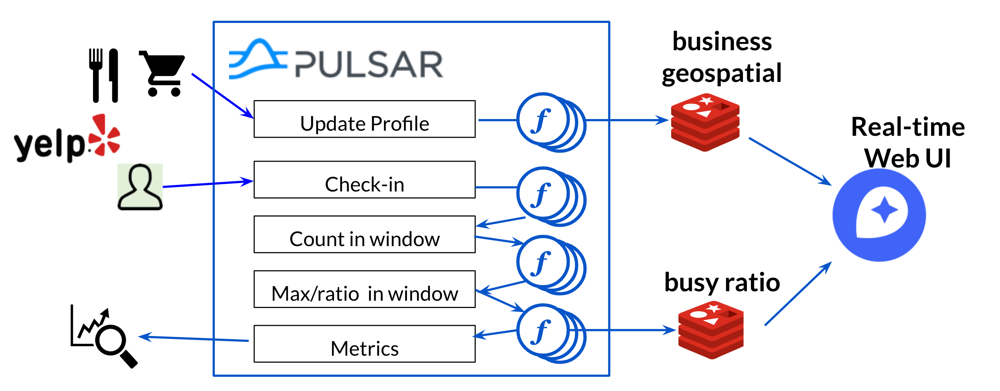
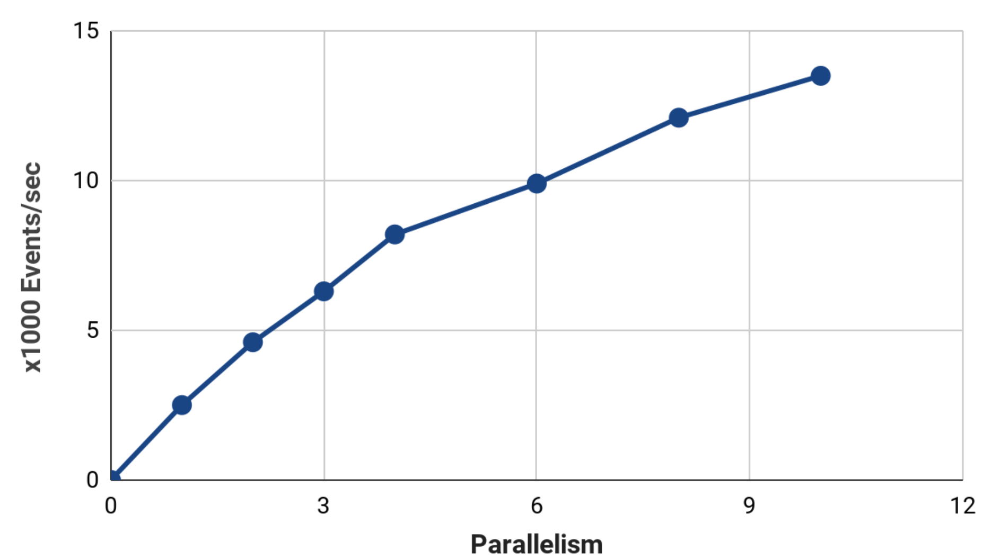

# Skip the line
This web app strive to solve the everlasting question:  should I wait in line or should I go to another place where there is no line?

This is achieved by tracking the current number of visitors using checkin information from Yelp. This contains visit info for 100k establishments (including 60k restaurants) across 11 cities, as well as restaurant profile and review info. The total check-in count in the past hour is considered an indicator for number of current visitors.  The maximum of this count in a 3 month period is then calculated to yield the maximum popularity of the establishment.  Both of these quantities are computed live and the up-to-date numbers are queried and visualized in the web app.

## Features

* To support a global application, the pipeline should be able to handle up to 10k events per second with subsecond latency.
* With 100k businesses across many locations, The users can query nearby businesses based on location on an interactive map.
* Both overall popularity and current "crowdedness" should be displayed and updated with second level responsiveness.
* The pipeline should be flexible and adaptive, allowing the current performance to be monitored and configurations to be adjusted in a flexible manner.

## Design
A streaming pipeline that can be adapted online by utilizing flexibilities provided by Pulsar functions.  Apache Pulsar, which is a next generation pub/sub messaging system that solves many of the existing problems of Apache Kafka, is used to handle the ingestion, serves as stream processing engine, and the topics also serve as databases for intermediate data.  Current visit information are stored in a Redis database.  The web app is implemented with Plotly Dash.

## Datasets

Currently, the following datasets are used.  For details,
see [data set specifications](dataset.md)
Primary dataset:

* Yelp Reviews and Check-ins

Datasets that the system is setup to incorporate but not yet part of the production pipeline:

* Foursquare check-in data
* UMN Foursquare check-in data
* Gowalla
* Google local reviews

## Cluster setup

See descriptions in the `cluster_setup` directory.

## Performance Benchmarks

With Pulsar Functions running a 3 node broker cluster (c5n.2xlarge, 24 CPUs total), parallisms up to 10 can be used.  I.e., 10 copies of window count and window max functions are run in parallel, with a throughput of up to 13k events/second.  The throughput benchmarks are shown below.  However, at this point the Redis connector becomes the bottleneck.  Further redesign of the pipeline, with a sharded Redis cluster, is required to further improve the throughput of the system.

