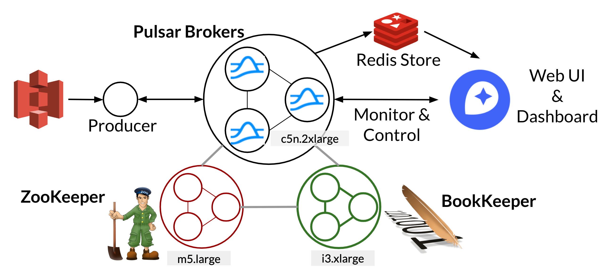

# Cluster Setup

The setup for this project consists mainly of a Pulsar cluster.  See the figure below.  For a proof of concept, the entire cluster reside in a single public VPC subnet on AWS.  The production will likely consist of multiple clusters in different regions to take advantage of Pulsar's georeplication functionality.  Here, user activity is emulated using a single node reading from S3 and producing to Pulsar.

The number and type of EC2 instances for each components and the installation guide is found in the table below.

## Component installation guides

In Pulsar, the storage and broker nodes are isolated.  Therefore storage optimized instances (i3) are used for bookie nodes and compute optimized instances with improved network bandwith (c5n) are used for the brokers.  In this setup we used Functions curated inside the broker cluster. Generic nodes (m5) is used for ZooKeepers. Pulsar has the option to setup a separate Functions worker cluster which would be useful when higher workload are required. c5n instances are generally picked due to significantly higher network bandwidth, which is found to be the limiting resource along with CPU.

|Name|Instances|Description|Resource|Installation|
|---|---|---|---|---|
|Broker |c5n.2xlarge*3|Pulsar Brokers and Functions|24CPUs|[Setup Pulsar Cluster](setup_pulsar.md)|
|ZooKeeper |m5.large*3|ZK for Pulsar||[Setup Pulsar Cluster](setup_pulsar.md)|
|BookKeeper |i3.xlarge*3|Bookies for Pulsar|3TB NVMe storage|[Setup Pulsar Cluster](setup_pulsar.md)|
|Producer|c5n.large|S3 reader script |   |[Setup Python worker](setup_python_worker.md)|
|Redis |c5n.xlarge|Redis server|10Gb Memory|[Setup Redis](setup_redis.md)|
|Dash |c5n.large|Web app server|   |[app.py](../dash_app/app.py)|

